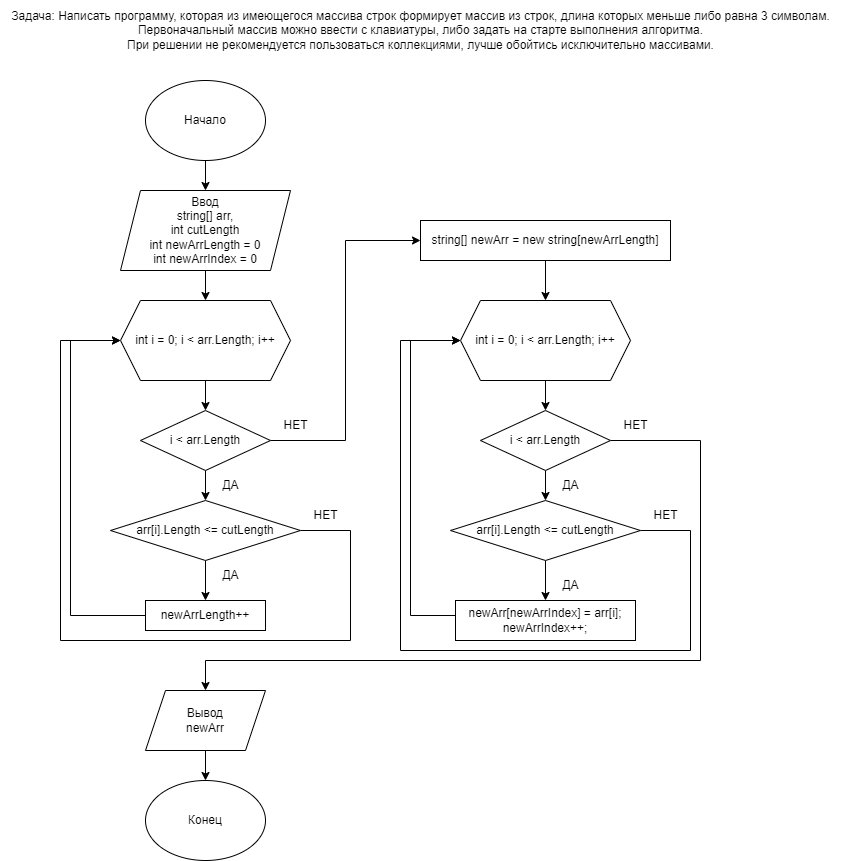

# Итоговая проверочная работа

Данная работа необходима для проверки ваших знаний и навыков по итогу прохождения первого блока обучения на программе разработчик. Мы должны убедиться что базовое знакомство с it прошло успешно.

Задача алгоритмически не самая сложная, однако для полноценного выполнения проверочной работы необходимо:
1. Создать репозиторий на GitHub
2. Нарисовать блок-схему алгоритма (можно обойтись блок-схемой основной содержательной части, если вы выделяете ее в отдельный метод)
3. Снабдить репозиторий оформленным текстовым описанием решения (файл README. md)
4. Написать программу, решающую поставленную задачу
5. Использовать контроль версий в работе над этим небольшим проектом (не дложно быть так что все залито одним коммитом, как минимум этапы 2, 3 и 4 должны быть расположены в разных коммитах)

---

**Задача:** 

Написать программу, которая из имеющегося массива строк формирует массив из строк, длина которых меньше либо равна 3 символам. Первоначальный массив можно ввести с клавиатуры, либо задать на старте выполнения алгоритма. При решении не рекомендуется пользоваться коллекциями, лучше обойтись исключительно массивами.

**Примеры:**

["hello", "2", "world", ":-)"] -> ["2", ":-)"]

["1234", "1567", "-2", "computer science"] -> ["-2"]

["Russia", "Denmark", "Kazan"] -> []

---

# Блок-схема алгоритма

# Текстовое описание решения

Программа формирует массив из строк, длина которых меньше либо равна 3 символам из имеющегося массива строк.

1. Создание метода. На вход метод имеет массив необходимый для обрезки и длину символов согласно которым будет произведена обрезка массива.
2. Первым циклом метода определяем длину выходного массива.
3. Вторым циклом добавляем в усеченный массив элементы из входного массива удовлетворяющих условию задачи.
4. Вывод усеченного массива.
5. Печать массива используя созданный метод.